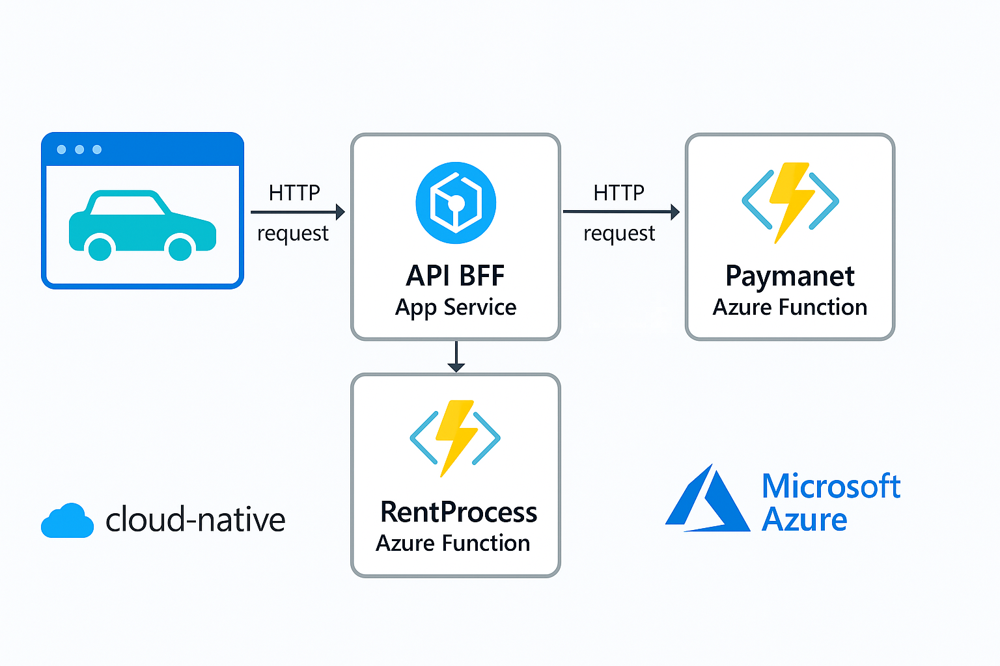
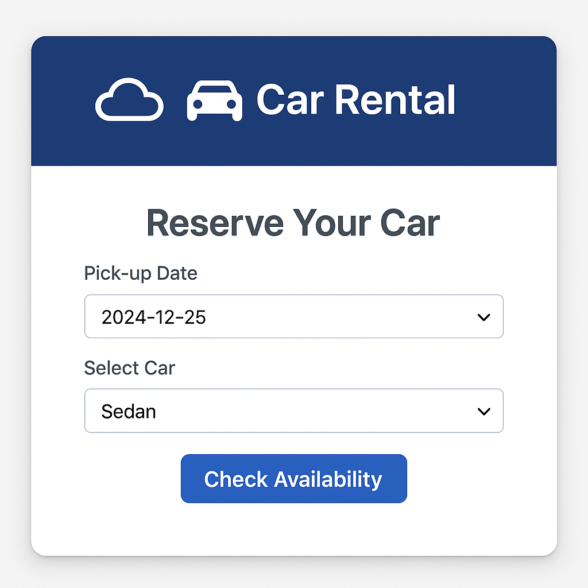

# 🚗 Aplicação de Aluguel de Carros 100% Cloud-Native com Azure

Este projeto foi desenvolvido como parte da formação Microsoft Application Platform da DIO. O objetivo é construir uma **aplicação moderna e escalável** para aluguel de carros, utilizando **arquitetura baseada em funções (Azure Functions)** e **serviços gerenciados em nuvem**, seguindo os princípios de aplicações cloud-native.

---

## 🧱 Estrutura do Projeto

O projeto é dividido em três principais componentes:

1. **API BFF (Backend for Frontend)** – Responsável por orquestrar as chamadas entre o front-end e os serviços da aplicação.
2. **Azure Function RentProcess** – Função dedicada à lógica de aluguel de veículos.
3. **Azure Function Paymanet** – Função separada para o processamento e validação dos pagamentos.

Cada parte foi criada para ser **desacoplada**, escalável de forma independente e facilmente testável.

---

## 🛠️ Etapas do Desenvolvimento

### 1. Desenho de Arquitetura - Configurar Ambiente Cloud

Começamos estruturando o ambiente na Azure, com criação de Resource Group, serviços de Functions, e definições de endpoints via App Service + API Management (opcional). Toda a aplicação é baseada em **eventos e requisições HTTP**.

---

### 2. Desenvolvimento da API BFF

- Criada com Node.js/Express
- Responsável por abstrair a complexidade das funções internas
- Permite comunicação unificada entre front-end e lógica de negócio

---

### 3. Azure Function RentProcess

Função criada para lidar com requisições de aluguel:
- Consulta de disponibilidade
- Registro da solicitação de locação
- Armazenamento de dados no banco (simulado ou CosmosDB)

---

### 4. Azure Function Paymanet

Função isolada para processamento de pagamentos:
- Validação de dados
- Retorno de status (sucesso, falha)
- Simulação de integração com gateway de pagamento

---

## 📸 Prints do Projeto

### Arquitetura Representada:

### Tela simulada:

> *(Substitua pelos prints reais ou use as imagens geradas por IA)*

---

## 💡 Aprendizados

- Como organizar uma aplicação cloud-native baseada em funções
- Separar lógica de negócio por responsabilidade
- Usar Azure Functions com foco em escalabilidade e baixo custo
- Integrar BFF com múltiplas funções usando boas práticas de API

---

## 🌍 Possibilidades Futuras

- Autenticação de usuários via Azure AD B2C
- Banco de dados real (Cosmos DB, SQL Azure)
- Envio de confirmação por e-mail com SendGrid
- Painel de administração para controle de locações

---

